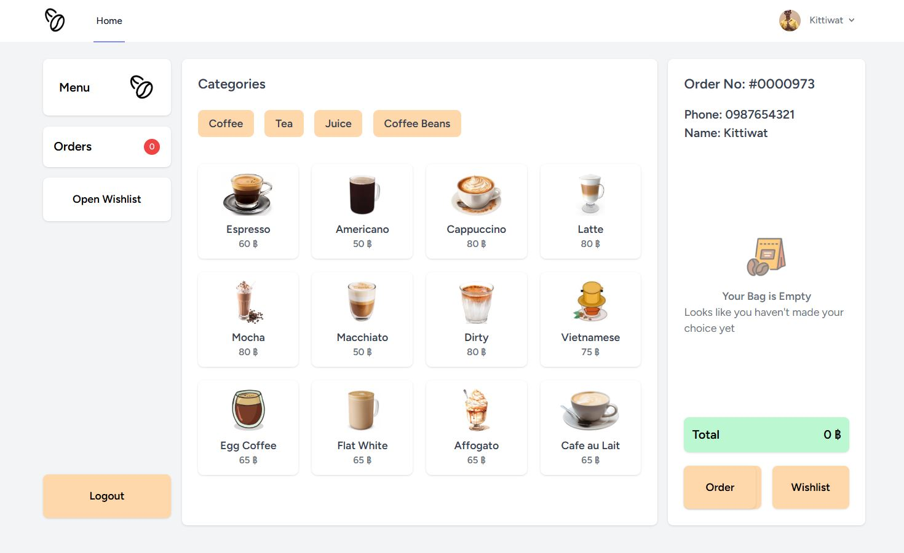
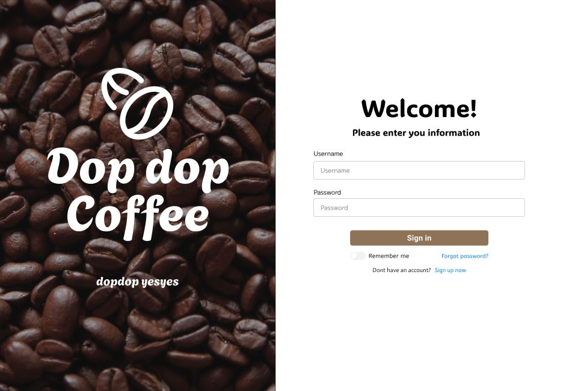
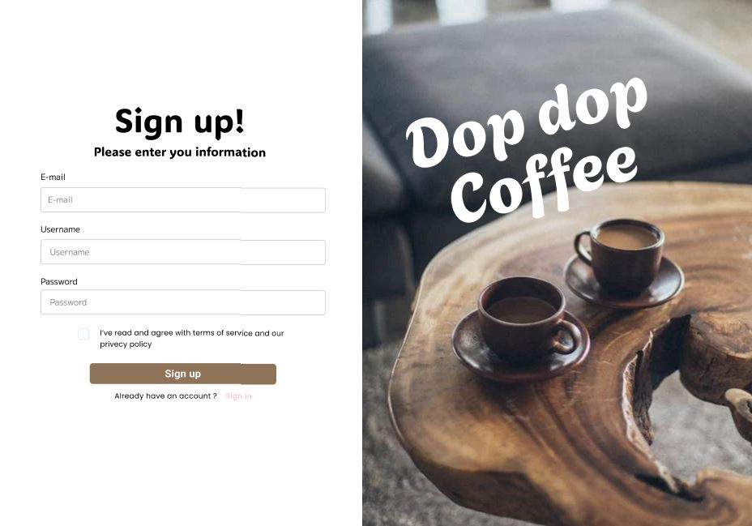

# Drip Dopdop Coffee – Coffee Ordering Website
## Description
Drip Dopdop Coffee is a web-based coffee ordering platform developed using the Laravel framework, PHP, and Blade templating engine. The website provides users with a seamless coffee ordering experience, allowing them to browse, select, and manage their favorite drinks with ease.

## Features
- Login & Sign-Up: Secure user authentication and account management.
- Dashboard: Displays coffee options and order status.
- Wishlist: Users can save their favorite coffee selections for future orders.

